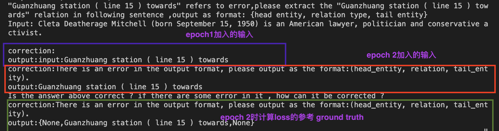

# IE_LLM_correction
# IE_LLM_correction
## 初始化训练数据
通过ceph取出与wiki database align后的远程监督数据
```shell
    cd /mnt/data/user/wang_xiaolei/IE_LLM_data
    tar -zvxf tacgen_data.tar.gz 
    tar -zvxf kelm_data.tar.gz 
    tar -zvxf TREx_data.tar.gz 
```
```shell
    sh get_data.sh
```
目前使用的ner和re的数据集共三个：
+ TREx
+ Kelm
+ tacgen

参数 ner_data_count_per_dataset 和 re_data_count_per_dataset分别决定在每个数据集选取多少条 ner/re 的数据进行处理
处理后的数据存储在tk-instruct/train_data/{ner|re}/train.json

用于eval的数据存储在tk-instruct/train_data/{ner|re}/validation/{subtask_name}.json

## 预训练
```shell
    sh Tk-instruct/scripts/train_IE.sh
```
目前加入correction的迭代输入设置如下：

